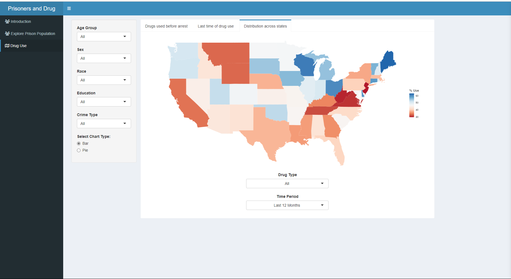

#   Shiny App to Explore Prison Survey

This is a shiny app that explores prison [survey data](https://doi.org/10.3886/ICPSR37692.V4) from year 2016.The Bureau of Justice Statistics (BJS) conducted the Survey of Prison Inmates (SPI), a national, wide-ranging survey of prisoners age 18 or older who were incarcerated in state or federal correctional facilities within the United States during 2016. We build this exploration tool to allow users to easily interact and visualize using filtered columns of data.

## Application

Running shiny_app.R would start the shiny application. 

  
  
  
  
  
  
  
  
  The code used to clean our data is found in data_clean.qmd. The original data source named CrimeData.csv is too large to upload to GitHub. The file can be found and downloaded from this [link.](https://drive.google.com/file/d/1cp8-IxaGGYTK0TYXG7eDiNBySRORNRKg/view?usp=sharing) 

Biniam Garomsa & Kelly Culpepper 
